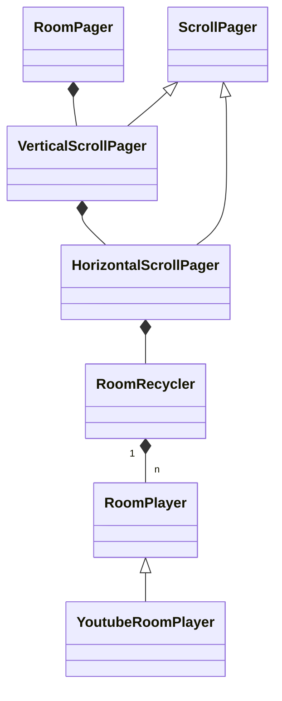

# RoomPager
RoomPager is 4-directional recycle pager view for create shortform video platform like youtube shorts and reels.

# Usage
```kotlin
implementation("com.github.DYGames:roompager:1.0.3@aar")
```

You can use it by implementing an Adapter and a ViewHolder, just like Android RecyclerView (not exactly the same. sry)

# [Explanation (Korean)](https://dygames.github.io/article.html?article=Android%EC%97%90%EC%84%9C%204%EB%B0%A9%ED%96%A5%20%EC%9E%AC%ED%99%9C%EC%9A%A9%20%EA%B0%80%EB%8A%A5%ED%95%9C%20%ED%8E%98%EC%9D%B4%EC%A7%95%20%EB%B7%B0%20%EB%A7%8C%EB%93%A4%EA%B8%B0%20+%20Youtube%20WebView%20%EC%9E%AC%EC%83%9D.md)


# Docs
## Adapter<T>
### createViewHolder(context: Context): T
- calls when RoomPager is initialized. adpater should provide viewholder instance
### getItemCount(): Int
- adpater should returns number of item in data set
### onRecycle(currentRoomPosition: Int, recycledViewHolders: List<ViewHolder>)
- calls when recycling is done (user scrolled). usually adapter play/pause video player here.
### onLoadNextRoom()
- load next room (video) data from server/local. you can update adapter's data set here.

## Adapter.ViewHolder
- define each View on RoomPager (usually full-screen video player)

# Demo
## [Diggin' Room](https://github.com/woowacourse-teams/2023-diggin-room)

[demo.webm](https://github.com/DYGames/RoomPager/assets/14182640/4124f5f0-afef-4be7-b23d-ff4c0fb446dc)
